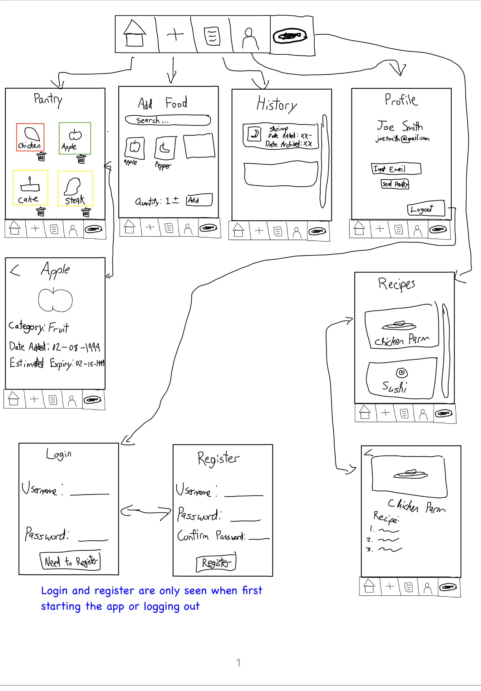

# Milestone 1 - PantryPal (Unit 7)
### By Jeremy Kurian, Safwan Noor, Haitham Awad
## Table of Contents

1. [Overview](#Overview)
1. [Product Spec](#Product-Spec)
1. [Wireframes](#Wireframes)

## Overview

### Description

Ever notice your pantry is becoming overflowed? This app will allow users to track the shelf life of their groceries. Users log grocery purchases and receive reminders before items expire. This app helps users reduce food waste and easily track what is going on in their pantry. It will be able to quickly and easily give a user notifications on expirary and when stuff is expiring soon. it will also be able to have multiple 

### App Evaluation

- **Mobile:**: Utilizes push notifations to alert users when a food item is expiring. Potential features time permitted for accessibility could include barcode scanning using camera in addition to serach as well as voice input.
- **Story:**: Millions of people throw away expired food every year and this leads to financial waste and environmental harm. This app can make it easy to track groceries to reduce waste and even plan meals effectively. 
- **Market:**: Families, college students, and environmentally conscious individuals. Anyone aiming to save money or organize their groceries can benefit.
 - **Habit:**: An average user who utilizes the app will open the app frequently especially the larger the pantry that they own or the size of their family. Because food is constantly going bad or expiring, the app will be constantly reminding and notifying the user as well as users having to enter in new food after every purchase. 
 - **Scope:** User will be able to add groceries by searching. Grocery information will be listed like name, category, and shelf life. Push notifications will be used to remind user of expiring items. Advanced features like recipe suggestions for soon-to-expire ingredients and family shared groceries can be implemented too if time permits. Very doable within a month and still good stripped down.

## Product Spec

### 1. User Features (Required and Optional)

**Required Features**

1. Create an account and store entries in database 
2. Search bar to input groceries.  
3. Extrapolate info from API about the category and shelf life of the product and display for all pantry items. 
4. Color coded UI to indicate urgency of a grocery's shelf life.
5. App will send push notifiactions when a grocery is close to expiring.

**Optional Features**

1. Ability to alternatively use camera and scan barcode to input groceries.
2. Recipe suggestions for soon-to-expire items.
3. Can create multiple pantries under one account.
4. Create a shared pantry with another user. 

### 2. Screen Archetypes

- Login Screen 
  - User can enter username and password to login.
- Register Screen 
  - User can create a new account with username, password, and confirm password.
- Add/Search Screen
    - User can search for a new food item with a searchbar.
    - User can view a list of grocery items related to the search prompt.
    - User can confirm an item to add to pantry.
- Pantry Screen 
    - User can view all groceries currently in their pantry.
    - User can see urgency of expiry date with color-coded UI around each item.
    - User can click a trash icon on item to archive to history screen.
- Groccey Item Screen (Clicked from Pantry Screen)
    - User can click on each grocery and see name, category, date added, and estimated expiry date for each item in a new view.
- Recipe Screen (Time permitted)
    - User can see a list of recipes based on the food in pantry and it will reccomend recipes with soon expiring recipes. 
    - User can click on an item to see the full recipe.
- History Screen
    - User can view a list of all items which have expired/archived.
    - User can view name, category, date added, and date archived for each item.

- Profile Screen
    -  User can enter in emails and their pantry information will be sent to that email with expiry and recipes.
    -  User can logout 

### 3. Navigation

**Tab Navigation** (Tab to Screen)

* Home/Pantry 
* Add Entries 
* History 
* Profile

**Flow Navigation** (Screen to Screen)

- Login Screen
  - => Home Screen
- Register Screen
  - => Home Screen
- Profile Screen
  - => Login Screen (from logout )
- Add Entries Screen
    - => None
- Home Page
    - => None, Feature version may be able to star feature and 

## Wireframes

 

 

### [BONUS] Digital Wireframes & Mockups

### [BONUS] Interactive Prototype

 

# Milestone 2 - Build Sprint 1 (Unit 8)

## GitHub Project board

User Stories Worked on, not fully completed
- Create an account, login, and store entries in database
- Search bar to input groceries.
- Page for grocceries and handle deleting groccies

[Add screenshot of your Project Board with three milestones visible in
this section]

## Issue cards

Shows issues from board, todo is for next sprint. In done, this sprint that is being uploaded
- [Add screenshot of your Project Board with the issues that you've been working on for this unit's milestone] 
- [Add screenshot of your Project Board with the issues that you're working on in the **NEXT sprint**. It should include issues for next unit with assigned owners.] 

## Issues worked on this sprint

- List the issues you completed this sprint

Ensure Tab Navigation Correctly Works
- [x] Should be able to go through all tabs

Basic Add Grocery Functionality (Hardcoded Data for Now)  

- [x] When a user enters a grocery name and clicks search, display a hardcoded response (e.g., `"Milk - Dairy - 7 Days"`)  
- [x] Clicking "Add" should insert it into the `RecyclerView` in the Pantry Screen  
- [x] No actual database storage yet

Login & Register Screen (No Database Yet - Just UI Navigation)  

- [x] Should display this screen first before showing all other tabs and screens 
- [x] Clicking "Login" should navigate to the Pantry Screen  
- [x] Clicking "Register" should navigate to the Pantry Screen  
- [x] Add basic input validation (e.g., empty fields)

Pop-up Screen for Pantry Items  

- [x] Create an XML layout for a pop-up screen displaying detailed item information  
- [x] Implement an `onClick` listener on pantry items to trigger the pop-up  
- [x] Ensure the pop-up includes the item's name, expiration date, calories, and an option to delete or edit  

Enter Grocery Screen (UI Only)  

- [x] Create an input field for entering grocery name  
- [x] Add field for expiration date (may be changed to AI later)
- [x] Clicking add button should close screen and redirect to the pantry screen with that new entry

Pantry Screen (UI Only)  

- [x] Create a `RecyclerView` for listing pantry items  
- [x] Add placeholder data for grocery items  
- [x] Implement a color-coded UI indicator for expiry urgency

Login & Register Screens (UI Only)
- [x] Create the Login Screen (`EditText` for username & password, login button)  
- [x] Create the Register Screen (`EditText` for username, password, confirm password, register button)  
- [x] Ensure basic UI consistency  
- [x] Should be first screen and filled out should redirect to Pantry page

Implement Bottom Navigation Tabs  

- [x] Create a `BottomNavigationView`  
- [x] Set up tabs for Home (Pantry), History, and Profile  
- [x] Use `FragmentContainerView` to switch between screens  

Set up Android Studio Project Structure 

- [x] Create a new Android Studio project
- [x] Set up Gradle dependencies
- [x] Push the initial setup to GitHub

- [Add giphy that shows current build progress for Milestone 2. Note: We will be looking for progression of work between Milestone 2 and 3. Make sure your giphys are not duplicated and clearly show the change from Sprint 1 to 2.]

 

 

# Milestone 3 - Build Sprint 2 (Unit 9)

## GitHub Project board

[Add screenshot of your Project Board with the updated status of issues for Milestone 3. Note that these should include the updated issues you worked on for this sprint and not be a duplicate of Milestone 2 Project board.] 
- [Add screenshot of your Project Board with the issues that you've been working on for this unit's milestone] 
- [Add screenshot of your Project Board with the issues that you're working on in the **NEXT sprint**. It should include issues for next unit with assigned owners.] 
## Completed user stories

- List the completed user stories from this unit

Completed User Stories
- Register, Login, Sign Out with Firebase Connection
- Store pantry items in database, create, delete.
- Generate Recipes page based on pantry items
- Color coded pantry based on expiry

- List any pending user stories / any user stories you decided to cut
from the original requirements

Pending User Stories 
- Notification on expiring pantry items
- Camera integration to quickly enter pantry info 

[Add video/gif of your current application that shows build progress]
 

##Issues WWorked on This Sprint
- #18 Recipes AI Integration
- #16 Color code Pantry by Expiry Urgency
- #17 Implement Recipes Page UI
- #15 Sort Pantry Page
- #12 Create Firebase Online
- #10 Connect to Firebase for Authentication
- #13 Profile Page with Sign Out Functionality
- #14 Connect to Firebase for Storing Pantry Items
- #19 Delete Pantry Item
- #11 Implement Sign up and Login using Firebase

## App Demo Video

- Embed the YouTube/Vimeo link of your Completed Demo Day prep video
[Demo Day Prep Video Here](https://youtu.be/EYFQyRc4g-A)

